<!-- Animated Header -->

  

<!-- Tech Stack Constellation -->

  

---

## Core Capabilities

<table>
<tr>
<td align="center" width="50%">

</td>
<td align="center" width="50%">

</td>
</tr>
<tr>
<td align="center" width="50%">

</td>
<td align="center" width="50%">

</td>
</tr>
<tr>
<td colspan="2" align="center">

</td>
</tr>
</table>

---

## About Koca Ventures

**Koca Ventures** is an enterprise technology company specializing in cutting-edge solutions across five core domains:

| Domain | Focus Areas | Key Technologies |
|--------|-------------|------------------|
| **Computer Vision** | Government-grade surveillance, multi-sensor fusion | YOLO, TensorRT, DeepStream |
| **Edge AI** | Production Jetson deployment, CUDA optimization | Jetson, TensorRT, CUDA |
| **Simulation** | Synthetic data, physics-based RL training | Isaac Sim, Unity, Blender |
| **Embedded** | Custom PCB design, RTOS development | STM32, ESP32, Teensy, FreeRTOS |
| **Robotics** | 6-DOF manipulation, perception stacks | ROS2, MoveIt2, PyBullet |

---

## Technology Stack

<b>AI & Machine Learning</b>

- **Inference**: TensorRT, DeepStream, ONNX Runtime
- **Training**: PyTorch, CUDA, cuDNN
- **Models**: YOLO, Custom CNNs, Transformer architectures

<b>Edge Computing</b>

- **Hardware**: NVIDIA Jetson (Orin, Xavier, Nano)
- **Optimization**: INT8/FP16 quantization, multi-stream inference
- **Performance**: 275+ TFLOPS, 8 concurrent streams

<b>Simulation & Digital Twin</b>

- **Platforms**: Isaac Sim, Unity, Blender
- **Features**: PhysX physics, RTX rendering, synthetic data
- **Pipelines**: Real-to-sim transfer, domain randomization

<b>Embedded Systems</b>

- **MCUs**: STM32, ESP32, Teensy, nRF52
- **RTOS**: FreeRTOS, Zephyr
- **Protocols**: CAN, Zigbee, LoRa, BLE
- **Tools**: KiCad, Altium Designer

<b>Robotics</b>

- **Framework**: ROS2 (Humble/Iron)
- **Planning**: MoveIt2, Nav2
- **Simulation**: PyBullet, Gazebo
- **Precision**: ±0.02mm repeatability

<b>Infrastructure</b>

- **Cloud**: AWS, Docker, Kubernetes
- **Database**: PostgreSQL, Redis
- **CI/CD**: GitHub Actions, ArgoCD

---

## Performance Metrics

| Metric | Value |
|--------|-------|
| Detection Accuracy | 99.7% |
| Inference FPS | 120+ |
| Edge TFLOPS | 275 |
| Arm Repeatability | ±0.02mm |
| Sim Physics FPS | 90 |

---

## Contact

  
  
  

---

<!-- Animated Footer -->

  

  London,UK

